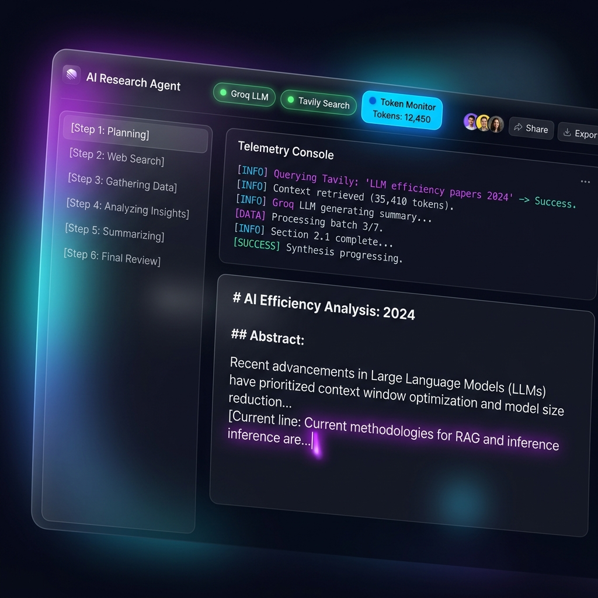
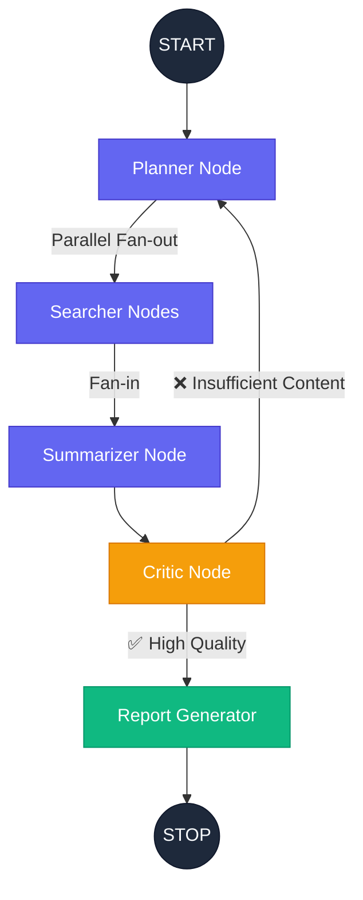

# 🚀 ResearchAgent: The Autonomous Synthesis Engine

[](https://github.com/Harsha430/graph-research/stargazers)
[](https://opensource.org/licenses/MIT)
[](https://www.python.org/)
[](https://reactjs.org/)

ResearchAgent is a production-grade, autonomous research system that orchestrates multiple LLMs using **LangGraph** to perform deep, multi-step web synthesis. Unlike standard RAG systems that simply retrieve and summarize, ResearchAgent **plans**, **searches parallelly**, **critiques its own findings**, and **self-corrects** until the result meets professional standards.

---

### 🖼️ System Showcase

*Modern Glassmorphism UI featuring live telemetry and real-time state tracking.*

---

## 🧠 Core Philosophy: "Intelligence Over Retrieval"

Most AI researchers stop after the first search. ResearchAgent follows a **Cyclic Reasoning Pattern**:
1. **Decomposition**: Breaking a complex topic into granular, searchable sub-questions.
2. **Parallel Fact-Finding**: Launching concurrent search workers to gather a broad knowledge base.
3. **Synthesis**: Merging disparate data points into a coherent narrative.
4. **Autonomous Critique**: A "Supervisor" node checks for hallucinations, missing data, or lack of depth.
5. **Recursive Refinement**: If the critique fails, the agent loops back to the planning stage with specific feedback.

---

## 🏗️ Graph Architecture (The Research Brain)

The system is orchestrated as a stateful directed acyclic graph (with loops) using **LangGraph**. This allows for complex state management and fan-out/fan-in parallel execution.



### 🛡️ Dual-Model Efficiency Strategy
To maximize performance while staying within **Groq Rate Limits**, we use a strategic model split:
- **Llama 3.1 8B (Fast)**: Powering the *Planner* and *Summarizer*. It handles the "heavy lifting" of data processing at light speed.
- **Llama 3.3 70B (Smart)**: Powering the *Critic* and *Report Generator*. It provides the deep reasoning and professional tone required for the final product.

---

## 📡 Live Telemetry & Streaming Protocol

ResearchAgent uses **Server-Sent Events (SSE)** to provide a "live heartbeat" of the research process. This ensures the user is never left staring at a loading spinner.

| Event Type | Logic | UI Effect |
| :--- | :--- | :--- |
| `step_start` | Triggered when a node begins execution. | Sidebar node highlights. |
| `log` | Real-time "thoughts" emitted by the agent. | Appends to the Telemetry Console. |
| `report_chunk` | Incremental report characters. | "Typed out" effect in the preview. |
| `usage` | Aggregated token consumption. | Updates the live Token Counter badge. |
| `done`| Signals the completion of the graph. | Enables Download/Copy actions. |

---

## 🚀 Installation & Zero-to-One Setup

### 1. Prerequisites
- **Python 3.10+** (Backend)
- **Node.js 18+** (Frontend)
- **Groq API Key**: [Get it here](https://console.groq.com/)
- **Tavily API Key**: [Get it here](https://tavily.com/)

### 2. Backend Installation
```bash
# Clone the repository
git clone https://github.com/Harsha430/graph-research.git
cd graph-research

# Set up virtual environment
python -m venv venv
source venv/bin/activate  # On Windows: venv\Scripts\activate

# Install dependencies
pip install -r requirements.txt

# Configure Environment
echo "GROQ_API_KEY=your_key" > .env
echo "TAVILY_API_KEY=your_key" >> .env

# Run FastAPI
python main.py
```

### 3. Frontend Installation
```bash
cd frontend
npm install
npm run dev
```

---

## 🛠️ Advanced Configuration

You can tune the research depth in `agent/nodes.py`:
```python
# Increase max_results for deeper (but more expensive) research
results = tavily.search(
    query=question,
    max_results=5, 
    search_depth="advanced"
)
```

---

## 🗺️ Roadmap & Future Enhancements
- [ ] **PDF Ingestion**: Allow the agent to research based on uploaded documents.
- [ ] **Multi-Model Support**: Support for Anthropic Claude and OpenAI GPT-4o.
- [ ] **Web Search Export**: Export all raw sources used in the research.
- [ ] **Dark/Light Mode**: Full theme customization.

---

## 🤝 Contributing
Contributions are what make the open source community such an amazing place to learn, inspire, and create. Any contributions you make are **greatly appreciated**.

1. Fork the Project
2. Create your Feature Branch (`git checkout -b feature/AmazingFeature`)
3. Commit your Changes (`git commit -m 'Add some AmazingFeature'`)
4. Push to the Branch (`git push origin feature/AmazingFeature`)
5. Open a Pull Request

## 📄 License
Distributed under the MIT License. See `LICENSE` for more information.

---
Built with 🔮 **LangGraph** & ⚡ **Groq** by [Harsha430](https://github.com/Harsha430)
