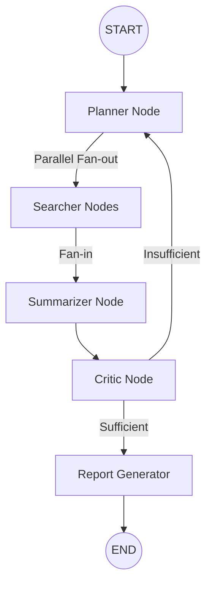

# 🚀 ResearchAgent: Autonomous Knowledge Synthesis

An advanced, multi-agent AI research assistant built with **LangGraph**, **Groq (Llama-3)**, and **React**. ResearchAgent doesn't just search the web; it plans, critiques, and synthesizes information into professional-grade reports in real-time.


## 🎥 Live Demonstration
*Imagine a GIF or Screenshot here showing the glassmorphism UI in action*

## 🏗 Graph Architecture
The intelligence is orchestrated as a stateful graph. It handles parallel search sub-tasks, evaluates information quality, and loops back for further research if initial findings are insufficient.



## 🌟 Key Features
- **Parallel Research**: Decomposes complex topics into sub-queries and executes them simultaneously using Tavily AI.
- **Autonomous Criticism**: A dedicated "Critic" node verifies information depth and accuracy before report generation.
- **Cost-Efficient Intelligence**: Dual-model strategy using Llama 3.1 8B for execution and Llama 3.3 70B for synthesis.
- **Live Telemetry**: Real-time websocket-like streaming (SSE) showing exactly what the agent is "thinking" and "searching."
- **Premium UX**: Modern glassmorphism UI with smooth animations and integrated token consumption tracking.

## 📦 Project Structure
```text
.
├── agent/             # Core LangGraph logic (Python)
├── frontend/          # React + Vite Dashboard (TypeScript)
├── tools/             # Search and retrieval utilities
├── main.py            # FastAPI Server entry point
└── requirements.txt   # Python dependencies
```

## 🚀 Quick Start

### 1. Requirements
Ensure you have **Python 3.10+** and **Node.js 18+** installed.

### 2. Environment Setup
Create a `.env` file in the root:
```env
GROQ_API_KEY=your_groq_api_key
TAVILY_API_KEY=your_tavily_api_key
```

### 3. Launch Backend
```bash
pip install -r requirements.txt
python main.py
```

### 4. Launch Frontend
```bash
cd frontend
npm install
npm run dev
```

## 📄 License
Distributed under the MIT License. See `LICENSE` for more information.

---
Built with ❤️ by [Harsha430](https://github.com/Harsha430)
